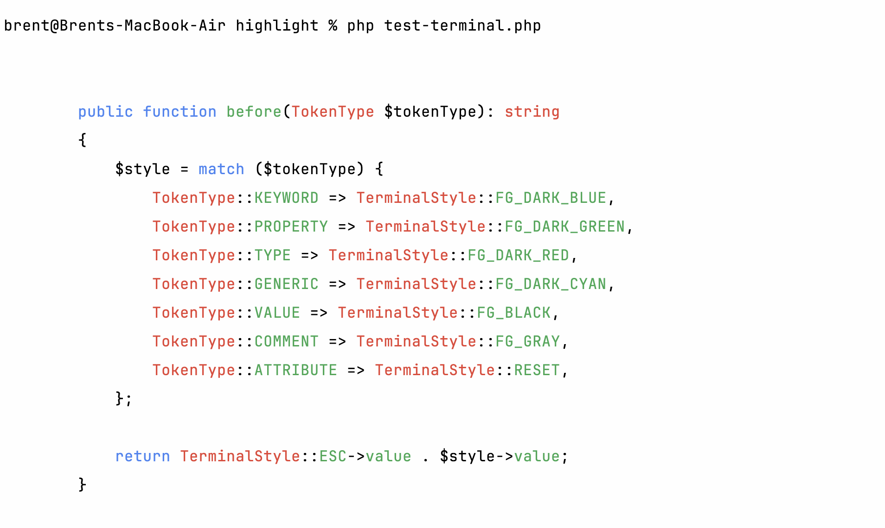
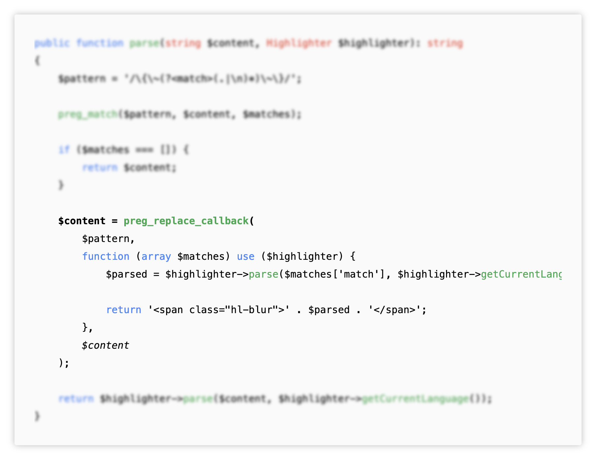
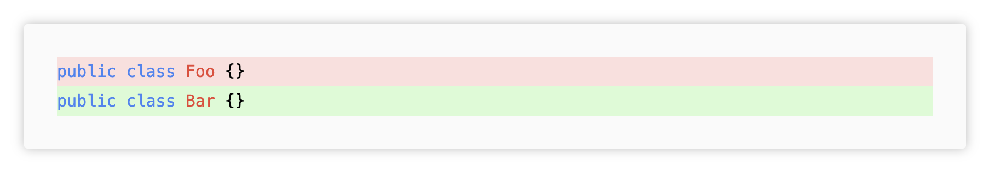
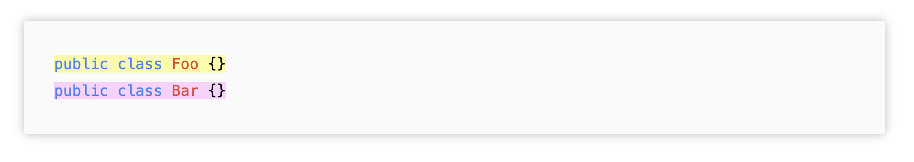

# Fast, extensible, server-side code highlighting
[](https://coveralls.io/github/tempestphp/highlight?branch=main)

You can read about why I started this package [here](https://stitcher.io/blog/a-syntax-highlighter-that-doesnt-suck).

- [Quickstart](#quickstart)
- [Supported languages](#supported-languages)
- [Themes](#themes)
  - [For the web](#for-the-web)
  - [For the terminal](#for-the-terminal)
- [Special highlighting tags](#special-highlighting-tags)
  - [Emphasize strong and blur](#emphasize-strong-and-blur)
  - [Additions and deletions](#additions-and-deletions)
  - [Custom classes](#custom-classes)
  - [Inline languages](#inline-languages)
- [Commonmark integration](#commonmark-integration)
- [Adding or extending languages](#adding-or-extending-languages)

## Quickstart

```php
composer require tempest/highlight:dev-main
```

Highlight code like this:

```php
$highlighter = new \Tempest\Highlight\Highlighter();

$code = $highlighter->parse($code, 'php');
```

## Supported languages

- [x] PHP
- [x] HTML
- [x] Blade
- [x] SQL
- [x] CSS
- [x] JavaScript
- [x] Twig
- [x] YAML
- [x] JSON
- [x] XML
- [x] GDScript

## Themes

### For the web

For HTML rendering, you can use one of the provided themes that comes with this package:

```css
@import "../vendor/tempest/highlight/src/Themes/highlight-light-lite.css";
```

You can build your own CSS theme with just a couple of classes:

```css
.hl-keyword {
    color: #4F95D1;
}

.hl-property {
    color: #46b98d;
}

.hl-attribute {
    font-style: italic;
}

.hl-type {
    color: #D14F57;
}

.hl-generic {
    color: #9D3AF6;
}

.hl-value {
  color: #000;
}

.hl-variable {
  color: #000;
}

.hl-comment span,
.hl-comment {
    color: #888888;
}

.hl-blur {
    filter: blur(2px);
}

.hl-strong {
    font-weight: bold;
}

.hl-em {
    font-style: italic;
}

.hl-addition {
    display: inline-block;
    min-width: 100%;
    background-color: #00FF0033;
}

.hl-deletion {
    display: inline-block;
    min-width: 100%;
    background-color: #FF000022;
}
```

Note that `pre` tag styling isn't included in this package.

### For the terminal

```php
use Tempest\Highlight\Highlighter;
use Tempest\Highlight\Themes\LightTerminalTheme;

$highlighter = new Highlighter(new LightTerminalTheme());

echo $highlighter->parse($code, 'php');
```



## Special highlighting tags

This package offers a collection of special tags that you can use within your code snippets. These tags won't be shown in the final output, but rather adjust the highlighter's default styling. All these tags work multi-line, and will still properly render its wrapped content.

### Emphasize, strong, and blur

You can add these tags within your code to emphasize or blur parts:

- `{_ content _}` adds the `.hl-em` class
- `{* content *}` adds the `.hl-strong` class
- `{~ content ~}` adds the `.hl-blur` class

Here's an example:

```php
{~public function parse(string $content, Highlighter $highlighter): string
{
    $pattern = '/\{\~(?<match>(.|\n)*)\~\}/';
    
    preg_match($pattern, $content, $matches);

    if ($matches === []) {
        return $content;
    }~} // This part is blurred

    {*$content = preg_replace_callback(*} // This line is bold
        $pattern,
        function (array $matches) use ($highlighter) {
            $parsed = $highlighter->parse($matches['match'], $highlighter->getCurrentLanguage());
            
            return '<span class="hl-blur">' . $parsed . '</span>';
        },
        {_$content_} // This line is cursive
    );
    
    {~return $highlighter->parse($content, $highlighter->getCurrentLanguage());
}~}
```

This is the end result:



### Additions and deletions

You can use these two tags to mark lines as additions and deletions:

- `{+ content +}` adds the `.hl-addition` class
- `{- content -}` adds the `.hl-deletion` class

```php
{-public class Foo {}-}
{+public class Bar {}+}
```



As a reminder: all these tags work multi-line as well:


```php
  public function before(TokenType $tokenType): string
  {
      $style = match ($tokenType) {
          {-TokenType::KEYWORD => TerminalStyle::FG_DARK_BLUE,
          TokenType::PROPERTY => TerminalStyle::FG_DARK_GREEN,
          TokenType::TYPE => TerminalStyle::FG_DARK_RED,
          TokenType::GENERIC => TerminalStyle::FG_DARK_CYAN,
          TokenType::VALUE => TerminalStyle::FG_BLACK,
          TokenType::COMMENT => TerminalStyle::FG_GRAY,
          TokenType::ATTRIBUTE => TerminalStyle::RESET,-}
      };
  
      return TerminalStyle::ESC->value . $style->value;
  }
```

### Custom classes

You can add any class you'd like by using the <code>{:classname: content :}</code> tag:

<pre>
&lt;style&gt;
.hl-a {
    background-color: #FFFF0077;
}

.hl-b {
    background-color: #FF00FF33;
}
&lt;/style&gt;

&#96;&#96;&#96;php
{:hl-a:public class Foo {}:}
{:hl-b:public class Bar {}:}
&#96;&#96;&#96;
</pre>



### Inline languages

Within inline Markdown code tags, you can specify the language by prepending it between curly brackets: 

<pre>
&#96;{php}public function before(TokenType $tokenType): string&#96;
</pre>

You'll need to set up [commonmark](#commonmark-integration) properly to get this to work.

## CommonMark integration

If you're using `league/commonmark`, you can highlight codeblocks and inline code like so:

```php
use League\CommonMark\Environment\Environment;
use League\CommonMark\Extension\CommonMark\CommonMarkCoreExtension;
use League\CommonMark\Extension\CommonMark\Node\Block\FencedCode;
use League\CommonMark\MarkdownConverter;
use Tempest\Highlight\CommonMark\CodeBlockRenderer;
use Tempest\Highlight\CommonMark\InlineCodeBlockRenderer;

$environment = new Environment();

$environment
    ->addExtension(new CommonMarkCoreExtension())
    ->addRenderer(FencedCode::class, new CodeBlockRenderer())
    ->addRenderer(Code::class, new InlineCodeBlockRenderer())
    ;

$markdown = new MarkdownConverter($environment);
```

Keep in mind that you need to manually install `league/commonmark`:

```php
composer require league/commonmark;
```

## Adding or extending languages

This package makes it easy for developers to add new languages or extend existing languages.

In order to build your own highlighter functionality, you need to understand _three_ concepts of how code is highlighted: _patterns_, _injections_, and _languages_. [Continue reading](https://stitcher.io/blog/building-a-custom-language-in-tempest-highlight).

You can also watch [this video](https://www.youtube.com/embed/cZugbAR8Fyg?si=F0wZf6QOxhsbPpOS) to get a better understand of the package's architecture: